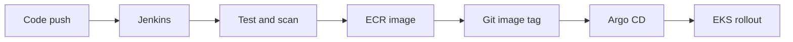

# Order Service Delivery Platform

This is a small retail order API together with the delivery platform I built around it. The application itself is intentionally simple; the main focus is the path from a code change to a controlled Kubernetes release.

I chose this project because it brings together the work I normally discuss in DevOps interviews: repeatable infrastructure, build quality gates, container security, GitOps deployment, observability and rollback.

**Author:** Anjani Kumar Jha  
**Primary stack:** AWS, Terraform, Jenkins, Docker, Kubernetes, Helm, Argo CD, Nginx and Prometheus

## What is in the repository

| Area | Implementation |
| --- | --- |
| API | Java 21, Spring Boot, Maven and JUnit |
| Image | Multi-stage Docker build with a non-root runtime user |
| CI | Jenkins pipeline; GitHub Actions performs pull-request validation |
| Registry | Amazon ECR with immutable tags and image scanning |
| Infrastructure | Terraform for VPC, EKS managed nodes and ECR |
| Deployment | Helm chart reconciled by Argo CD |
| Traffic | Nginx Ingress |
| Operations | Health probes, HPA, PDB, Prometheus metrics and a runbook |

## Delivery flow



Jenkins builds an image tagged with the short application commit SHA. It then clones the separate `order-service-gitops` repository and updates `charts/order-service/values-dev.yaml`. Argo CD watches that repository and applies the Helm release. Jenkins does not deploy directly to the cluster; this keeps build responsibility and deployment responsibility separate and avoids a pipeline loop caused by committing release changes back to the application repository.

## Run it locally

The quickest path needs only Docker:

```bash
docker compose up --build -d
curl http://localhost:8080/actuator/health
curl http://localhost:8080/api/v1/orders
```

Create a sample order:

```bash
curl -X POST http://localhost:8080/api/v1/orders \
  -H 'Content-Type: application/json' \
  -d '{"item":"Kubernetes Handbook"}'
```

Stop the service:

```bash
docker compose down
```

The same commands are available through the Makefile:

```bash
make local-up
make smoke
make local-down
```

## Run it on local Kubernetes

Prerequisites: Docker, kind, kubectl and Helm.

```bash
chmod +x scripts/*.sh
./scripts/deploy-local-kind.sh
```

The script creates a local cluster if required, loads the image, installs the chart and waits for the Deployment to become available. It then starts a port-forward on `localhost:8080`.

Useful checks:

```bash
kubectl get pods,service,hpa,pdb -n orders-dev
kubectl describe deployment orders-dev-order-service -n orders-dev
kubectl logs -n orders-dev deployment/orders-dev-order-service --tail=100
```

For an EKS environment, install the platform add-ons before creating the Argo CD Application:

```bash
./scripts/bootstrap-platform.sh
kubectl apply -f gitops-repository/argocd/application.yaml
```

The bootstrap script installs Nginx Ingress, Metrics Server, Prometheus/Grafana and Argo CD through Helm. Review chart values and pin chart versions before treating this as a controlled production rollout.

## AWS infrastructure

The Terraform configuration creates billable AWS resources. Review the plan before applying it.

```bash
cd infra/terraform
cp terraform.tfvars.example terraform.tfvars
terraform fmt -check
terraform init
terraform validate
terraform plan -out=tfplan
terraform apply tfplan
```

Terraform outputs the `aws eks update-kubeconfig` command and the ECR repository URL. For a shared environment, configure an encrypted remote state backend based on `backend.tf.example`.

Destroy lab infrastructure when it is no longer needed:

```bash
terraform destroy
```

## Pipeline stages

The Jenkinsfile follows this sequence:

1. Checkout and derive the image tag from the Git SHA.
2. Run Maven tests and archive the test report/JAR.
3. Run SonarQube and wait for its quality gate when `RUN_SONAR` is enabled.
4. Build the container image.
5. Stop the pipeline for unfixed critical vulnerabilities reported by Trivy.
6. Authenticate to ECR and push the immutable image from `main`; a rerun keeps an existing SHA-tagged artifact instead of overwriting it.
7. Clone the separate GitOps repository and commit the new image tag through an SSH deploy key.
8. Let Argo CD detect that Git revision and perform the rollout.

The Jenkins agent needs Java 21, Maven, Docker, AWS CLI, Trivy, `yq` and Git. Jenkins needs Pipeline, Git, Docker Pipeline, SSH Agent, SonarQube Scanner and Workspace Cleanup plugins. The repository uses the Jenkins SSH credential ID `github-deploy-key` and the optional SonarQube installation name `sonarqube`. Give the deploy key write access to the GitOps repository, add GitHub to the Jenkins user's `known_hosts`, and point SonarQube's webhook to Jenkins for `waitForQualityGate`.

## Values to change before the first cloud run

Search for placeholders:

```bash
grep -R "replace-me\|REPLACE_" -n . --exclude-dir=.git
```

Update:

- Create `anjani222/order-service-gitops` from the supplied `gitops-repository/` directory.
- Confirm its URL in `gitops-repository/argocd/application.yaml` and the Jenkins parameter.
- Image repository in both Helm values files.
- ECR repository parameter/default in `Jenkinsfile`.
- Terraform remote-state names if remote state is enabled.
- EKS public endpoint CIDR (`203.0.113.10/32` is a documentation-only placeholder).
- Argo CD repository credentials when the GitOps repository is private.

Use an IAM role for the Jenkins workload rather than storing AWS access keys in the repository.

## Rollback approach

The deployment version is recorded in Git. To roll back, revert the commit that changed the image tag:

```bash
git log --oneline -- charts/order-service/values-dev.yaml
git revert <deployment-commit>
git push origin main
argocd app sync order-service-dev
```

This restores the earlier desired state and leaves an audit trail. The operational checks are documented in `docs/RUNBOOK.md`.

## Design notes and trade-offs

- Application code and desired deployment state use separate repositories. The `gitops-repository/` directory is included here only as seed content for creating `order-service-gitops`; after setup, Jenkins and Argo CD work with that separate repository.
- A single NAT gateway keeps the development environment cheaper, but it is not an availability design for production.
- The sample API stores no data. A real order service would use a managed database, migration tooling, secret injection and backup/restore tests.
- TLS, DNS and external secret management are intentionally left as environment-specific work rather than hidden behind example credentials.
- The ServiceMonitor is disabled by default because it requires the Prometheus Operator CRDs.

More detail is recorded in `docs/DECISIONS.md`.

The dependency baseline and the date it was reviewed are recorded in `docs/VERSIONS.md`.

For a concise recruiter-facing overview, see `docs/HR_PROJECT_BRIEF.md`. The distinction between completed structural checks and runtime evidence still to be collected is recorded in `docs/IMPLEMENTATION_STATUS.md`.

## Current verification status

Repository-level XML, YAML, shell syntax and archive checks have been completed. The local and AWS runbooks are included so build output, screenshots and cloud results can be collected in the target environment. No production traffic, availability or cost-saving numbers are claimed by this repository.

## Project summary for a CV

**Order Service GitOps Delivery Platform | AWS, Terraform, Jenkins, Docker, EKS, Helm and Argo CD**

- Built an Infrastructure-as-Code baseline for an EKS application platform, including VPC networking, managed worker nodes and an ECR repository.
- Created a Jenkins delivery pipeline covering Maven tests, container build, vulnerability scanning, immutable image tagging and Git-based release promotion.
- Packaged the service with Helm and configured Argo CD reconciliation, health probes, rolling updates, autoscaling and disruption protection.
- Exposed application health and Prometheus metrics and documented common diagnosis and rollback procedures.

## Repository map

```text
app/                         Spring Boot API and tests
infra/terraform/             AWS infrastructure
gitops-repository/           Seed content for the separate GitOps repository
scripts/                     Local deployment, add-on bootstrap and validation
docs/                        Design decisions, runbook, demo notes and versions
.github/workflows/           Pull-request checks
Jenkinsfile                  Main delivery pipeline
Dockerfile                   Application image
Makefile                     Common local commands
```
